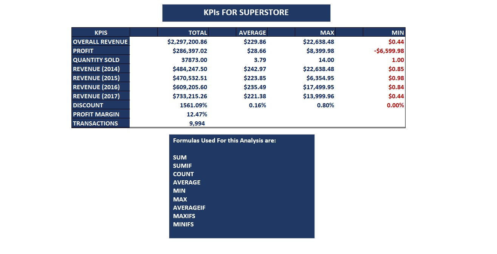
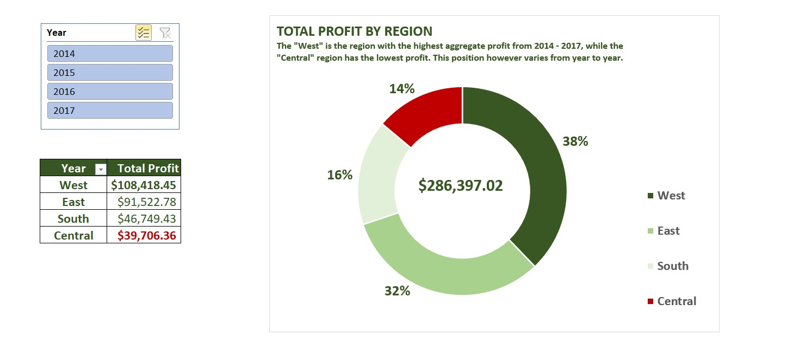
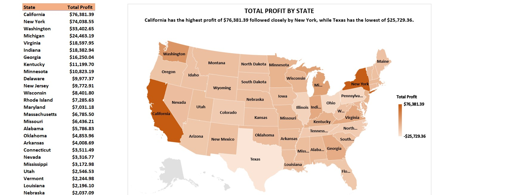
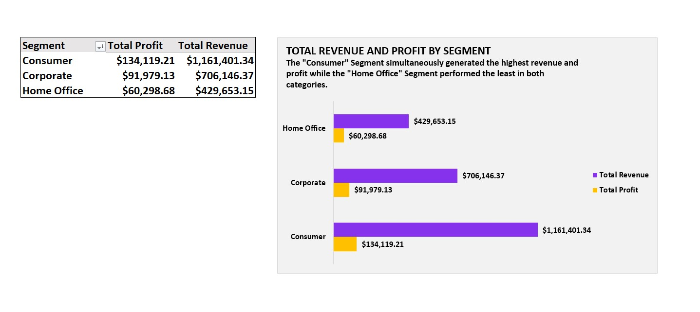
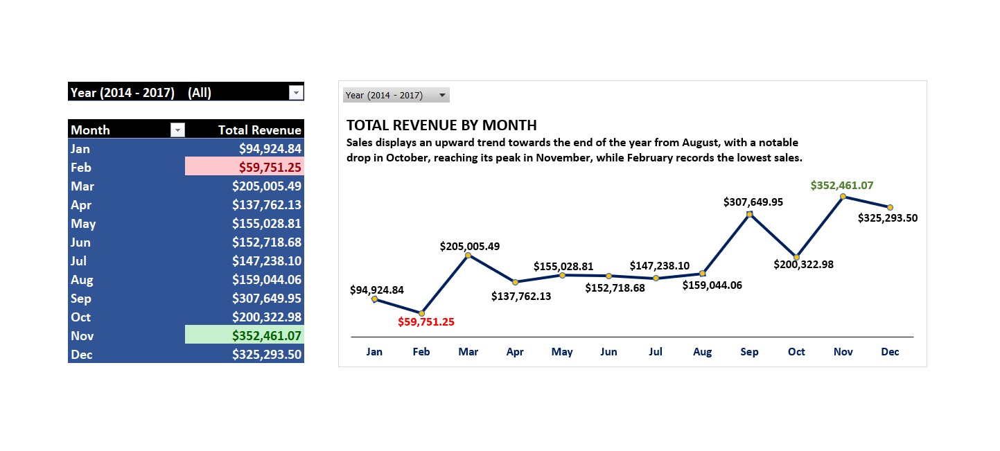
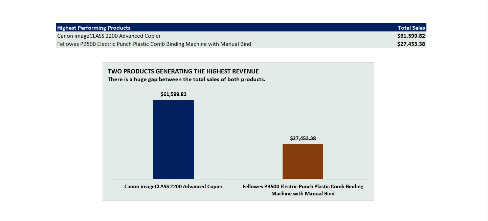

# BUSINESS ANALYSIS FOR A SUPERSTORE IN-THE UNITED STATES

## Introduction

In this GitHub repository, I've delved deep into the performance of a United States superstore, utilizing a dataset spanning the years 2014 to 2017. This analysis covers a spectrum of critical aspects, shedding light on the store's financial health and strategic opportunities and help the store make data driven decisions.

**_Disclaimer_** : All datasets and reports do not represent any company, institution or country. This is a dummy dataset meant to demonstrate my capabilities as a Data analyst using Microsoft Excel.

## Business Questions

1.	Which Region is the Sales Champion?
2.	Which State in the United States generates the highest profit?
3.	Which Segments of the Superstore yields more income for the business?
4.	Are there any noticeable seasonal Sales trend?
5.	Has the Revenue declined over the years, what is the projection for year 2018?
6.	Which product sells highest and how does it compare to the second bestselling product?

## Key Performance Indicators Analysis

1.	Overall Revenue
2.	Profit
3.	Quantity of Products Sold
4.	Yearly Sales Growth Rate
5.	Profit Margin
6.	Total Number of Transactions

**_Image below represents key performance indicators and excel functions and formulas used_**

## Skills / Concepts Demonstrated

-	Data Import and formatting
-	Data sorting and filtering
-	Formulas and Functions
-	Data analysis tools (Pivot Tables and Pivot Charts)
-	Conditional Formatting
-	Data Validation

## Data Analysis and Visualization

Analysis of the yearly sales data from 2014 to 2017 in Excel leverages various skills and tools, such as data aggregation, conditional formatting, and chart creation. These techniques enable us to gain valuable insights into sales trends and performance over the specified time frame, helping us make data-informed decisions for the store's future strategies.

##Which Region is the Sales Champion?

The West region of the United States generates higher sales due to a combination of factors. It boasts economic prosperity, high population density, thriving tech and innovation hubs, significant tourism, unique cultural and lifestyle factors, influential real estate markets, and the presence of major entertainment and media industries. Effective marketing, competition, and favourable climate also contribute to the region's strong sales performance. These elements collectively position the Western U.S. as a vital area for business and retail operations, driving increased consumer spending and sales.

The Central region of the United States contributes to lower sales for various reasons. These include lower population density, economic challenges, reliance on non-consumer industries, the absence of major urban centers, seasonal variations, limited competition, market dynamics, consumer preferences, infrastructure challenges, and marketing constraints. These factors collectively affect the region's sales performance, necessitating targeted strategies to enhance sales and business growth.

## Which State generates the highest profit?

The variation in sales between California (highest) and New York (second-highest) compared to Texas (lowest) is primarily due to differences in population size, diverse economies, major urban centers, higher income levels, and tourist attraction. These factors create larger consumer markets and increased spending capacity, contributing to higher sales in California and New York, while the economic composition and regional dynamics in Texas impact its sales performance.

## Which Segments of the Superstore yields more income for the business?

The analysis of segments within the Superstore reveals that the Consumer segment leads in sales revenue due to its larger size and purchasing power. However, the Home Office segment, although making fewer sales, yields higher profit per sale, likely attributed to factors like higher margins, lower operational costs, potential volume discounts, and a more profitable product mix. The Corporate segment contributes significant revenue and profit, often driven by negotiated contracts and business-to-business arrangements. These dynamics highlight the Superstore's diverse strategies for income generation across its segments.

##Are there any noticeable seasonal Sales trend?

The sales trend analysis indicates seasonal fluctuations, with sales typically lower from January to July, gradually increasing in August, experiencing a dip in October, and a substantial increase in November. February consistently records the lowest sales. This trend aligns with seasonal shopping patterns, likely influenced by events like holiday shopping in November and a post-holiday slump in January and February.

## Has the Revenue declined over the years, what is the projection for year 2018?

The revenue trend suggests an annual sales increase, with 2017 recording the highest sales. It's highly likely that this growth will continue into 2018, indicating a positive trajectory. The lowest sales were in 2015, marking a significant improvement in subsequent years, indicative of the business's overall upward trend.

## Which product sells highest and how does it compare to the second bestselling product?

The Canon ImageClass 2200 Advanced Copier clearly dominates the sales charts, signifying strong customer demand and strategic positioning within the Superstore's offerings. In contrast, the Fellowes PB500 Electric Punch Plastic Comb Binding Machine with Manual Bind secures the second-best position but with significantly lower sales. This notable gap may indicate differing market demand, pricing strategies, or the product's significance within the Superstore's catalog. Further analysis is essential to understand the factors driving this disparity and consider adjustments to enhance the second-best product's performance.

## Conclusion  

The Superstore analysis reveals a distinct seasonal sales pattern, with peak sales in November and lower sales in early months. Consumer segments drive sales, while the Home Office segment, with fewer sales but higher profit per sale, holds potential. Corporate contracts play a vital role in revenue.

## Recommendations
1.	Leverage seasonal trends for targeted promotions.
2.	Tailor strategies to customer segments.
3.	Focus on cost control and margin optimization.
4.	Explore expansion and market penetration.
5.	Implement customer retention strategies.
6.	Prioritize data-driven decision-making.
7.	Stay competitive with continuous analysis and adaptation.

#CHEERS!

